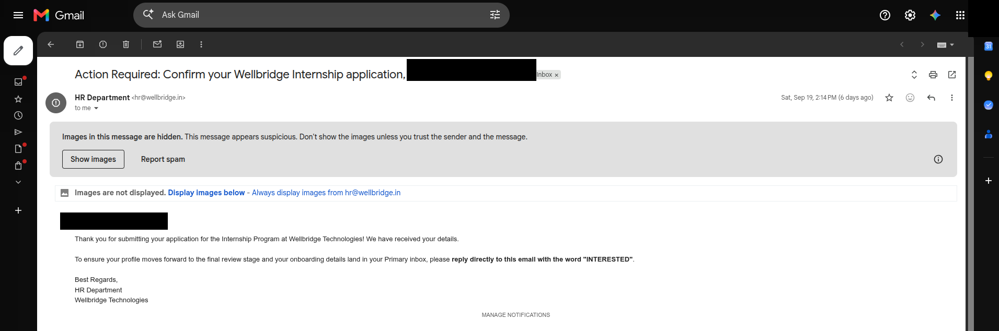
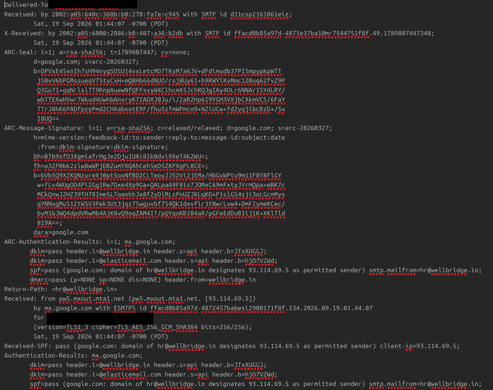
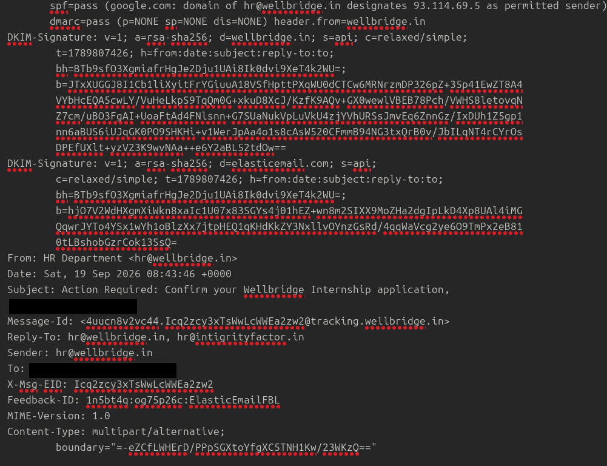
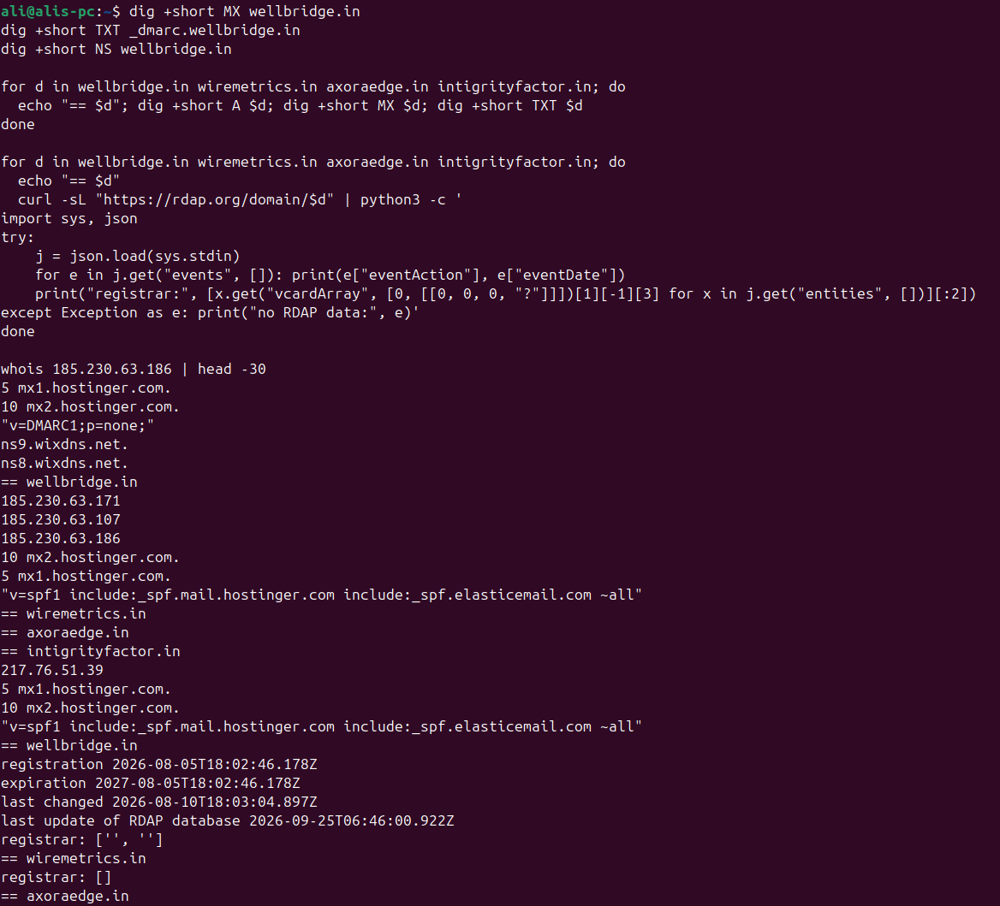
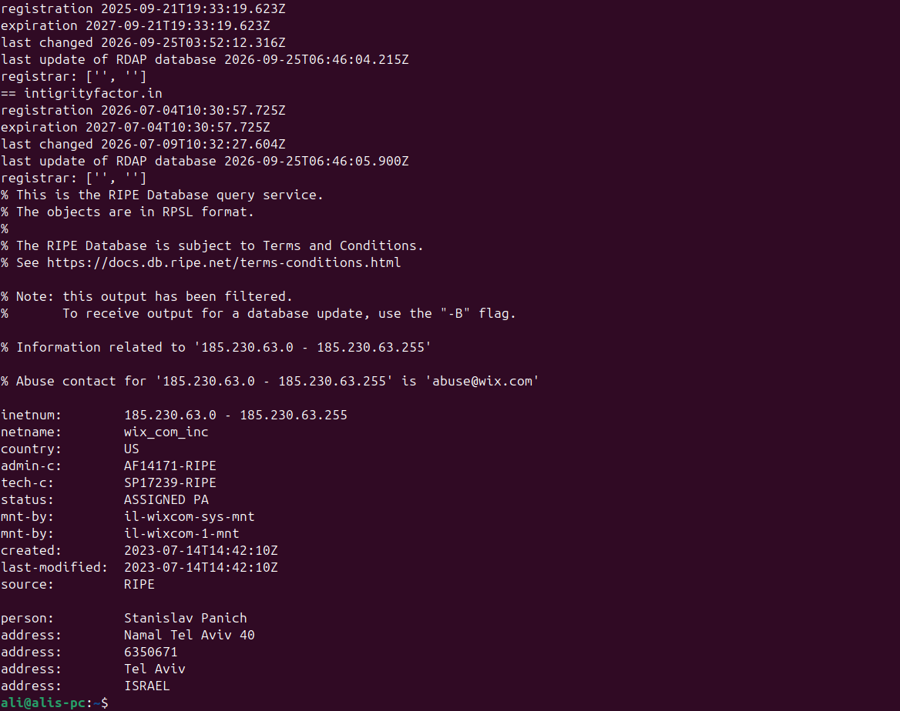
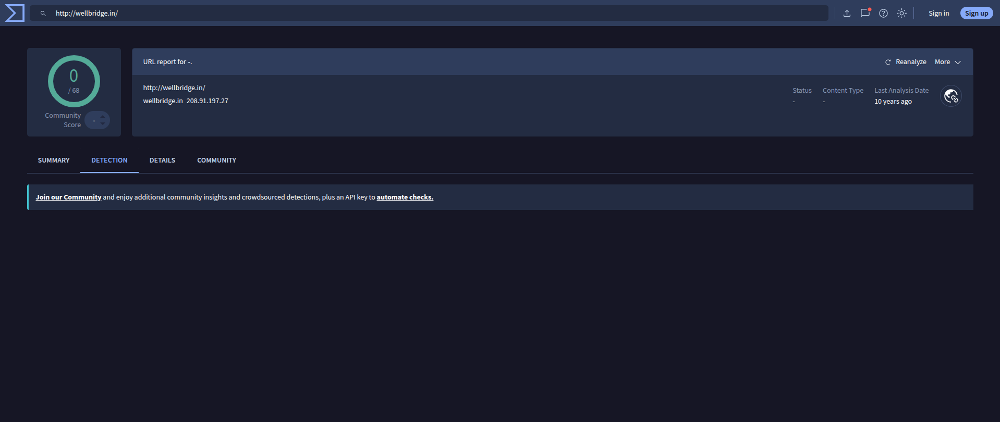

# Email Triage Report: "Wellbridge Technologies" Fake Internship (Advance-Fee Fraud)

| | |
|---|---|
| **Analyst** | Mohammad Hasnain Ali |
| **Analysis date** | 2026-09-20 |
| **Samples** | 2 emails (`.eml`) + 1 PDF attachment, received 2026-09-19 and 2026-09-20 |
| **Verdict** | **Malicious: advance-fee ("pay-to-intern") fraud with social-engineering funnel. No malware found.** |
| **Confidence** | High (fee demand + unrealistic pay + template match to publicly reported scam) |
| **Method** | Static analysis only. No links opened, no attachments rendered in a viewer, no replies sent. |

> Recipient details (name, address) and per-recipient tracking tokens are redacted. All domains and URLs are defanged (`hxxps://`, `[.]`).

---

## 1. Executive summary

The recipient received two automated emails one day apart from `hr@wellbridge[.]in`, offering a "Cyber Security Internship."

- **Email 1 (19 Sep):** asks the recipient to reply `INTERESTED` to "confirm" an application.
- **Email 2 (20 Sep):** announces "shortlisting" and attaches a "Welcome Letter" PDF.
- **The payload is inside the PDF, not the email body:** it demands a **₹1,551 "internship fee"** to "CONFIRM enrolment" while promising a **₹23,000/month in-hand salary** and an eventual full-time offer of "up to ₹5 LPA."

Both messages **pass SPF, DKIM and DMARC**. That only proves the sender controls the domain `wellbridge[.]in`; it says nothing about legitimacy. The sender domain `wellbridge[.]in` was **registered on 2026-08-05, only 45 days before the first email**, and the campaign appears to reuse one template across several brand domains (see §5).

## 2. Timeline

| UTC time | Event |
|---|---|
| 2026-09-19 08:43:46 | Email 1, "Action Required: Confirm your Wellbridge Internship application" |
| 2026-09-20 08:43:31 | Email 2, "Shortlisting & Welcome Letter" + PDF |
| 2026-09-20 ~08:43:32 | PDF generation timestamp (embedded in filename, 14:13:32 IST), ~1 second from send |

The same clock time on consecutive days, and a PDF generated within ~1 s of sending, indicate a scheduled, scripted mail-merge pipeline rather than a human HR team.

## 3. Header analysis



Gmail flagged Email 1 as suspicious on its own and hid its images by default — a useful independent signal alongside the technical analysis below.

| Field | Email 1 | Email 2 | Notes |
|---|---|---|---|
| From | `HR Department <hr@wellbridge[.]in>` | `Wellbridge Technologies <hr@wellbridge[.]in>` | Display name changes between mails |
| Return-Path / Sender | `hr@wellbridge[.]in` | `hr@wellbridge[.]in` | Aligned with From |
| **Reply-To** | `hr@wellbridge[.]in`, **`hr@intigrityfactor[.]in`** | `support@wellbridge[.]in` | **Email 1 adds a second, unrelated domain**; replies would be copied to it |
| Sending IP | 93.114.69.5 (`pw5.mxout.mta1.net`) | 142.44.153.169 (`nc169.mxout.mta3.net`) | Bulk-mail (ESP) pool |
| SPF | pass | pass | |
| DKIM | pass (`d=wellbridge[.]in`, `d=elasticemail[.]com`, `s=api`) | pass (same) | Sent through **Elastic Email**, a bulk-mail service |
| DMARC | pass, `p=none` | pass, `p=none` | Policy is monitor-only |
| Message-ID host | `tracking.wellbridge[.]in` | `tracking.wellbridge[.]in` | ESP click/open tracking on the scammer's own subdomain |

**Key point:** authentication passing is expected here because the actor registered and configured `wellbridge[.]in` themselves. "Authenticated" ≠ "trustworthy."




## 4. Body, link and attachment analysis

### Email bodies
- Email 1 contains **no fee, no role details and no link to act on.** Its only ask is "reply INTERESTED", which validates that the mailbox is monitored and improves future inbox placement. Both are typical list-qualification tactics.
- Email 2 states "stipend as mentioned in the Welcome Letter" and pushes the recipient to open the PDF. **The fee is deliberately kept out of the email text**, so text-based filters never see it.
- Tracking pixel (1x1) in both; a hidden `display:none` "botclick" link (an ESP mechanism for detecting link scanners).
- Visible link text `https://www.wellbridge[.]in/form` points to a **`tracking.wellbridge[.]in/tracking/click?d=…` redirector** (display/target mismatch; final destination not resolved in this analysis).

### PDF attachment (`Welcome_<name>_20260920_141332_<id>.pdf`)


- SHA-256: `347baa2dceb7be86a549012846fc642f58c3b8090ed5fb814ad189580a515429`. This is **personalized per recipient** (contains the name), so it has low IOC value across victims.
- 4 pages, A4, PDF 1.4, producer `pypdf` (programmatic generation), 3 small raster images.
- **No JavaScript, no OpenAction/Launch, no embedded files, no forms, not encrypted.** The keyword scan showed no active content (see Appendix A for the exact commands and output).
- A **fake "APPROVED" rubber-stamp graphic** and a scanned signature appear next to the fee demand on page 2, styled to look like a signed, authorized document.
- Clickable links found (page: URI):
  - p2–3: `hxxps://www[.]wellbridge[.]in/form`
  - p2: `hxxps://www[.]wiremetrics[.]in/form`
  - p3: `hxxps://www[.]axoraedge[.]in/form`
  - p4: `hxxps://www[.]wellbridge[.]in/`
  - p4: `hxxps://www[.]linkedin[.]com/company/innovateloop-solutions/` (**labeled "LinkedIn: Wellbridge Technologies"**)
  - p4: a `forms[.]gle/…` Google Form labeled as the "official" channel for complaints and unsubscribe requests
- **Invisible overlapping link annotations on page 2:** five separate, invisible clickable rectangles tile most of the visible body text (the "Career Opportunities" paragraph and the line above the fee demand), all pointing to `wiremetrics[.]in/form` — a **different domain than the one visible, underlined hyperlink on the same page**, which points to `wellbridge[.]in/form`. A misclick anywhere in that block of text opens the other brand's payment form instead of the one the reader sees. (Confirmed by comparing each link annotation's rectangle coordinates against the visible text — see Appendix A.) This could be leftover artifacts from copy-pasting the template between brand variants rather than deliberate cloaking, but the effect on a reader is the same either way.

### Content red flags
1. **Fee to receive an internship:** "you are required to pay 1551/-" (stated twice, pages 2 and 3).
2. **Pay too good to be true:** ₹23,000/month in-hand for a 1-month remote intern, plus "up to ₹5 LPA" full-time.
3. **No interview, no résumé request:** "selected" immediately; "flexible joining date, any date of your choice."
4. **Benefits sold as the hook:** certificate, Letter of Recommendation and "stipend and appreciation letter."
5. **Vague stipend condition:** paid only after completing a client project assigned *after* the fee is paid.
6. **Urgency / speed pressure:** credentials and onboarding "by End of Day" after payment.
7. **Inconsistencies:** email says "Remote / Bangalore," letter says fully remote; the LinkedIn link belongs to a different company name than the letter's header.
8. **Complaint channel controlled by the sender:** complaints go to a Google Form, not an accountable contact.
9. **Gag-style clause:** interns must not discuss their work publicly, including "among friends, college."
10. **Visual authority props:** a fake "APPROVED" stamp and a scanned signature dressed up to look like a signed, official document (see screenshot above).


## 5. Infrastructure / brand-rotation observations

One letter references **five different names or domains**: `wellbridge[.]in`, `wiremetrics[.]in`, `axoraedge[.]in`, `intigrityfactor[.]in` (Reply-To) and a LinkedIn page called "innovateloop-solutions." A single legitimate employer does not normally do this. It suggests either a shared operator behind several shell brands or a reused kit with leftover references, which is consistent with rotating brands after complaints.

**External corroboration.** A May 2026 Business Today report describes an internship offer letter with the same structure: a ~₹23,000 pay promise, an "internship fee" (₹1,594) to confirm enrolment via a "form" link, credentials and onboarding "by end of day," and a flexible joining date. Readers reported receiving similar offers. This matches the template here but does **not** by itself name Wellbridge. No public reports specifically naming the domains above were found in the searches run for this report.
Source: https://www.businesstoday.in/amp/latest/trends/story/company-ko-pocket-money-chahiye-techie-shares-rs23000-internship-offer-letter-but-with-an-unexpected-demand-533454-2026-05-27

### Domain and hosting intelligence (collected 2026-09-24 via `dig` and RDAP)




| Domain (defanged) | Registered | Expires | Last changed | DNS observed |
|---|---|---|---|---|
| `wellbridge[.]in` | **2026-08-05** | 2027-08-05 | 2026-08-10 | A: 185.230.63.107 / .171 / .186 (Wix-owned range per RIPE); NS: `ns8/ns9.wixdns[.]net`; MX: `mx1/mx2.hostinger[.]com`; SPF: Hostinger + Elastic Email, `~all`; DMARC: `p=none` |
| `intigrityfactor[.]in` | 2026-07-04 | 2027-07-04 | 2026-07-09 | A: 217.76.51.39; MX: Hostinger; **SPF identical to wellbridge[.]in** |
| `axoraedge[.]in` | 2025-09-21 | 2027-09-21 | **2026-09-21** | No A/MX/TXT records returned |
| `wiremetrics[.]in` | No registration data returned by RDAP | n/a | n/a | No A/MX/TXT records returned |

Observations:
- **The claimed employer's domain is ~6 weeks old** at the time of the first email (45 days). `intigrityfactor[.]in`, used in Reply-To, was ~11 weeks old.
- **Split infrastructure:** website/DNS on Wix, mail on Hostinger, bulk sending via Elastic Email. All three are commodity services that any small operator can rent.
- **Shared mail configuration:** `wellbridge[.]in` and `intigrityfactor[.]in` have the same MX records and the same SPF string (Hostinger plus Elastic Email). This is consistent with a common administrator but is not proof, since setups are often copied from tutorials.
- **`axoraedge[.]in` was registered a year earlier** and modified on 2026-09-21, the day after Email 2, and now returns no records. Possible explanations include a takedown, a deliberate DNS wipe or a parked domain; the cause is unknown. A PDF link to a domain that no longer resolves is dead evidence of a template that outlived its site.
- **`wiremetrics[.]in`** returned no RDAP data and no DNS records. It may be unregistered, expired or a data gap; this is unverified.
- The three Wix IPs are all A records of `wellbridge[.]in` itself (round-robin), not one IP per brand. They are in a shared Wix range, so they are low-value for blocking.

### Reputation check (VirusTotal)



`wellbridge[.]in` shows a community score of **0/68** on VirusTotal, but that record should not be read as "clean." The cached analysis is for IP `208.91.197.27` — a different IP from the Wix range found above — and is listed as **last analyzed roughly 10 years ago**. That's a stale, pre-existing record from whoever held this domain long before the current registration. It predates the 2026-08-05 registration found in §5 by about a decade, which fits a common pattern: an aged, previously-used `.in` domain that was allowed to expire and was later re-registered by a new owner for its slightly better reputation than a brand-new domain. VirusTotal has not yet crawled the domain under its current ownership and content, so the 0/68 score reflects the old site, not this campaign. A "Reanalyze" run (or a fresh urlscan.io submission) would be needed for a current verdict.

## 6. Indicators of Compromise (IOCs)

| Type | Value (defanged) | Context |
|---|---|---|
| Email | `hr@wellbridge[.]in`, `support@wellbridge[.]in` | From / Sender / Reply-To |
| Email | `hr@intigrityfactor[.]in` | Extra Reply-To (Email 1) |
| Domain | `wellbridge[.]in`, `tracking.wellbridge[.]in` | Sender, tracking/redirector |
| Domain | `wiremetrics[.]in`, `axoraedge[.]in`, `intigrityfactor[.]in` | Referenced in PDF / Reply-To |
| IP | `93.114.69.5`, `142.44.153.169` | Elastic Email sending pool (shared, so low value for blocking) |
| URL | `hxxps://www[.]wellbridge[.]in/form`, `…wiremetrics[.]in/form`, `…axoraedge[.]in/form` | Payment/enrolment form links |
| URL | `hxxps://forms[.]gle/Do2RcnVYE73RgnP4A` | "Complaint" Google Form |
| Hash | SHA-256 `347baa2d…515429` | Per-recipient PDF (low reuse value) |
| IP | `185.230.63.107`, `185.230.63.171`, `185.230.63.186` | `wellbridge[.]in` A records (Wix range; shared, low blocking value) |
| IP | `217.76.51.39` | `intigrityfactor[.]in` A record |
| Nameserver | `ns8[.]wixdns[.]net`, `ns9[.]wixdns[.]net` | Authoritative DNS for `wellbridge[.]in` |
| IP (stale) | `208.91.197.27` | Old VirusTotal-cached IP for `wellbridge[.]in`, ~10 years old; not the current hosting IP |
| Amount | ₹1,551 | Fee demanded |

## 7. MITRE ATT&CK mapping (closest fits)

ATT&CK models intrusions and fits advance-fee fraud only loosely. The nearest techniques:

| Technique | Relevance |
|---|---|
| T1583.001 Acquire Infrastructure: Domains | Multiple purpose-registered brand domains |
| T1566.001 Phishing: Spearphishing Attachment | Lure delivered via a (non-malicious) PDF |
| T1598.003 Phishing for Information: Spearphishing Link | "/form" links collecting personal and payment data |
| T1656 Impersonation | Posing as a legitimate employer / HR |

## 8. Response and recommendations

**Recipient:** do not pay, do not reply "INTERESTED", do not submit the form. Report the message as phishing in the mail client and block the sender.
**Report:** India's National Cyber Crime Reporting Portal (cybercrime.gov.in) or helpline **1930**; also notify the college placement cell so other students are warned. If money was already paid, report to 1930 immediately and contact the bank/UPI provider.
**Provider abuse reports:** file abuse reports with the services the operator rents: Wix (website hosting; the RIPE record for the range lists its abuse contact), Hostinger (mail hosting), Elastic Email (the bulk sender identified by the DKIM signature and Feedback-ID header), and the registrar once identified.
**Detection ideas:** flag inbound mail where (a) the attachment text contains "internship" + "fee/pay" + a currency amount, (b) Reply-To domain differs from From domain, (c) the sender domain is recently registered and sending via an ESP.

## 9. Lessons learned

1. SPF/DKIM/DMARC `pass` proves domain control, not intent.
2. The malicious content was moved into an attachment to evade body-text scanning, so attachments must be analyzed too.
3. Automation tells (identical send times, PDF generated ~1 s before sending, `pypdf` producer) are useful triage signals.
4. A legitimate employer never charges the candidate; the payment demand alone is decisive.

## Appendix A: commands and output

Everything below was run on Ubuntu (WSL/native). Recipient name and email are redacted with `[REDACTED]`; the attachment's original filename (which contained the recipient's name) is shown as `[REDACTED_FILENAME].pdf`.

### A.1 — Email header and authentication parsing (Python `email` module, no network)

```
$ python3 - <<'EOF'
import email, glob
from email import policy
for f in sorted(glob.glob("*.eml")):
    m = email.message_from_file(open(f, encoding="utf-8", errors="replace"), policy=policy.default)
    for k in ["From","Sender","Return-Path","Reply-To","Subject","Date","Message-ID"]:
        print(f"{k}: {m.get(k)}")
    print("Authentication-Results:", m.get("Authentication-Results"))
EOF
```
```
======================================================================
Action_Required__Confirm_your_Wellbridge_Internship_application__[REDACTED].eml
From: HR Department <hr@wellbridge.in>
Sender: hr@wellbridge.in
Return-Path: <hr@wellbridge.in>
Reply-To: hr@wellbridge.in, hr@intigrityfactor.in
Subject: Action Required: Confirm your Wellbridge Internship application, [REDACTED]
Date: Sat, 19 Sep 2026 08:43:46 +0000
Message-ID: <4uucn8v2vc44.Icq2zcy3xTsWwLcWWEa2zw2@tracking.wellbridge.in>
Authentication-Results: mx.google.com;
    dkim=pass header.i=@wellbridge.in header.s=api header.b=JTxXUGGJ;
    dkim=pass header.i=@elasticemail.com header.s=api header.b=hjO7V2Wd;
    spf=pass (google.com: domain of hr@wellbridge.in designates 93.114.69.5 as permitted sender) smtp.mailfrom=hr@wellbridge.in;
    dmarc=pass (p=NONE sp=NONE dis=NONE) header.from=wellbridge.in
======================================================================
Your_Wellbridge_Internship_Shortlisting___Welcome_Letter__[REDACTED].eml
From: Wellbridge Technologies <hr@wellbridge.in>
Sender: hr@wellbridge.in
Return-Path: <hr@wellbridge.in>
Reply-To: support@wellbridge.in
Subject: Your Wellbridge Internship Shortlisting & Welcome Letter, [REDACTED]
Date: Sun, 20 Sep 2026 08:43:31 +0000
Message-ID: <4uucy9ps1fzy.6JuVISAJnCMtPZc4WPO-xw2@tracking.wellbridge.in>
Authentication-Results: mx.google.com;
    dkim=pass header.i=@wellbridge.in header.s=api header.b="UX5ui/yz";
    dkim=pass header.i=@elasticemail.com header.s=api header.b=XZerVFpX;
    spf=pass (google.com: domain of hr@wellbridge.in designates 142.44.153.169 as permitted sender) smtp.mailfrom=hr@wellbridge.in;
    dmarc=pass (p=NONE sp=NONE dis=NONE) header.from=wellbridge.in
```
`eml_triage.py` in this repo automates this step, plus URL extraction and attachment hashing, in one command.

### A.2 — Attachment hashing and PDF static analysis (`poppler-utils`)

```
$ sha256sum "[REDACTED_FILENAME].pdf"
347baa2dceb7be86a549012846fc642f58c3b8090ed5fb814ad189580a515429  [REDACTED_FILENAME].pdf

$ pdfinfo "[REDACTED_FILENAME].pdf"
Producer:        pypdf
Pages:           4
Encrypted:       no
Page size:       595.5 x 842.25 pts (A4)
File size:       233039 bytes
PDF version:     1.4

$ pdfdetach -list "[REDACTED_FILENAME].pdf"
0 embedded files

$ for k in /JS /JavaScript /OpenAction /AA /Launch /URI /EmbeddedFile /RichMedia /SubmitForm /AcroForm /XFA /ObjStm /Encrypt; do
    printf "%-14s %s\n" "$k" "$(grep -a -c -- "$k" file.pdf)"
  done
/JS            0
/JavaScript    0
/OpenAction    0
/AA            12   <- false positive, see below
/Launch        0
/URI           28
/EmbeddedFile  0
/RichMedia     0
/SubmitForm    0
/AcroForm      0
/XFA           0
/ObjStm        0
/Encrypt       0

$ grep -a -o -- "/AA." file.pdf | sort | uniq -c   # confirm the 12 hits above are not real /AA actions
     12 /AAA
```
The 12 `/AA` matches are all `/AAA` — three-letter prefixes of embedded font subset names such as `AAAAAA+TimesNRMTPro` — not `/AA` Additional-Actions dictionaries. There is no JavaScript-on-open or similar active content in the file.

### A.3 — Extracting every clickable link with its page and rectangle (`pypdf`)

```
$ python3 - <<'EOF'
from pypdf import PdfReader
r = PdfReader("file.pdf")
for i, pg in enumerate(r.pages, 1):
    for a in pg.get("/Annots", []) or []:
        a = a.get_object()
        act = a.get("/A")
        if act:
            uri = act.get_object().get("/URI")
            rect = a.get("/Rect")
            if uri:
                print(f"page {i}: rect={[round(float(x),1) for x in rect]}  uri={uri}")
EOF
```
```
page 2: rect=[178.0, 313.6, 391.9, 330.1]  uri=https://www.wellbridge.in/form
page 2: rect=[43.7, 198.8, 112.0, 213.8]   uri=https://www.wiremetrics.in/form
page 2: rect=[43.7, 158.3, 188.5, 173.3]   uri=https://www.wiremetrics.in/form
page 2: rect=[43.7, 77.3, 130.0, 92.3]     uri=https://www.wiremetrics.in/form
page 2: rect=[43.7, 57.0, 126.3, 72.0]     uri=https://www.wiremetrics.in/form
page 2: rect=[126.3, 57.0, 433.1, 72.0]    uri=https://www.wiremetrics.in/form
page 2: rect=[433.1, 57.0, 534.4, 72.0]    uri=https://www.wiremetrics.in/form
page 3: rect=[167.0, 318.9, 170.8, 334.7]  uri=https://www.axoraedge.in/form
page 3: rect=[170.8, 318.9, 368.1, 334.7]  uri=https://www.wellbridge.in/form
page 4: rect=[91.3, 114.5, 233.1, 128.0]   uri=https://www.wellbridge.in/
page 4: rect=[91.3, 95.0, 232.4, 108.5]    uri=https://www.linkedin.com/company/innovateloop-solutions/
page 4: rect=[27.5, 39.5, 96.6, 50.0]      uri=https://forms.gle/Do2RcnVYE73RgnP4A
page 4: rect=[96.6, 39.5, 116.8, 50.0]     uri=https://forms.gle/Do2RcnVYE73RgnP4A
page 4: rect=[121.3, 39.5, 138.6, 50.0]    uri=https://forms.gle/Do2RcnVYE73RgnP4A
```
The five `wiremetrics.in` rectangles on page 2 span most of the page's text lines — this is the basis for the "invisible overlapping link" finding in §4.

### A.4 — Locating and redacting the recipient's name for the screenshots (`pdftotext -bbox`, Pillow)

```
$ pdftotext -bbox file.pdf bbox.xml
$ grep -n "Mohammad\|Hasnain\|>Ali<" bbox.xml
17:    <word xMin="87.480000" yMin="257.785960" xMax="181.476000" yMax="273.985960">Mohammad</word>
18:    <word xMin="185.976000" yMin="257.785960" xMax="250.002000" yMax="273.985960">Hasnain</word>
19:    <word xMin="254.502000" yMin="257.785960" xMax="277.506000" yMax="273.985960">Ali</word>
```
Confirmed a single occurrence, on page 1. Rendered the page with `pdftoppm -r 150 -png file.pdf page` and blacked out that bounding box (scaled from 72dpi to 150dpi) with Pillow before saving `pdf-page1-welcome-redacted.png`. A follow-up text search across all 4 pages for the recipient's name and email address returned no further matches.

### A.5 — DNS and domain registration (run by the recipient; sandbox here had no DNS egress)

```
$ dig +short MX wellbridge.in
5 mx1.hostinger.com.
10 mx2.hostinger.com.

$ dig +short TXT wellbridge.in
"v=spf1 include:_spf.mail.hostinger.com include:_spf.elasticemail.com ~all"

$ dig +short TXT _dmarc.wellbridge.in
"v=DMARC1;p=none;"

$ dig +short NS wellbridge.in
ns8.wixdns.net.
ns9.wixdns.net.

$ dig +short A wellbridge.in
185.230.63.107
185.230.63.171
185.230.63.186

$ dig +short A intigrityfactor.in
217.76.51.39

$ dig +short A axoraedge.in wiremetrics.in
(no output — no A records)

$ curl -sL "https://rdap.org/domain/wellbridge.in" | python3 -m json.tool   # registration dates
# wellbridge.in       -> registration 2026-08-05T18:02:46Z
# intigrityfactor.in  -> registration 2026-07-04T10:30:57Z
# axoraedge.in         -> registration 2025-09-21T19:33:19Z, last changed 2026-09-21T19:34:20Z
# wiremetrics.in       -> no RDAP record returned

$ whois 185.230.63.186 | head -30
inetnum:        185.230.63.0 - 185.230.63.255
netname:        wix_com_inc
country:        US
abuse contact:  abuse@wix.com
```

## Appendix B: reproducibility

`eml_triage.py` (included in this repo) parses the `.eml` files, prints header/authentication results, extracts URLs and attachment hashes, and makes **no network requests**. It automates §A.1.
